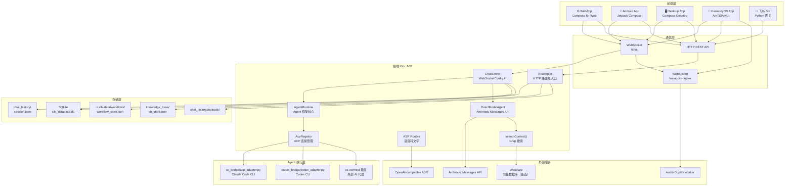
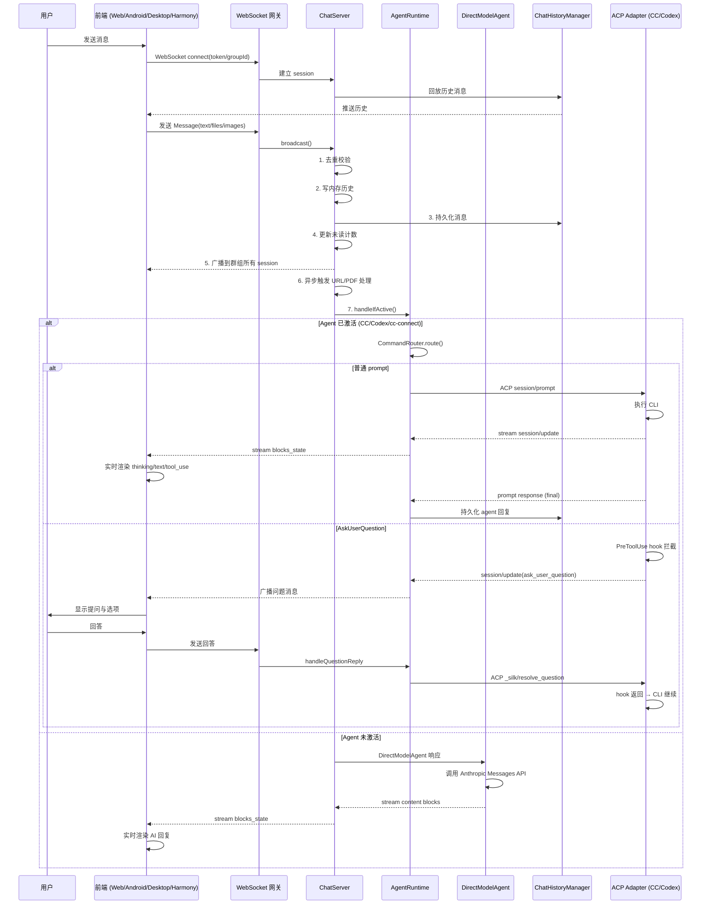
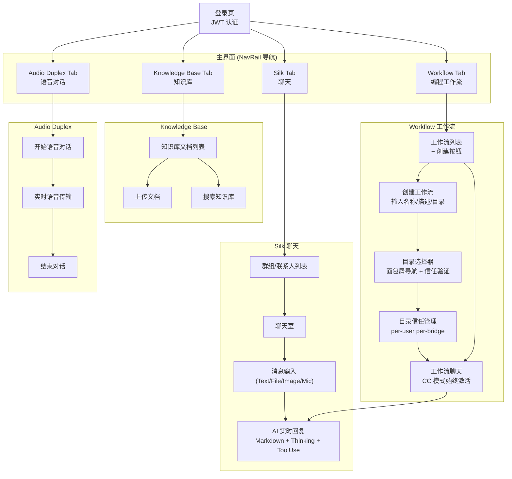
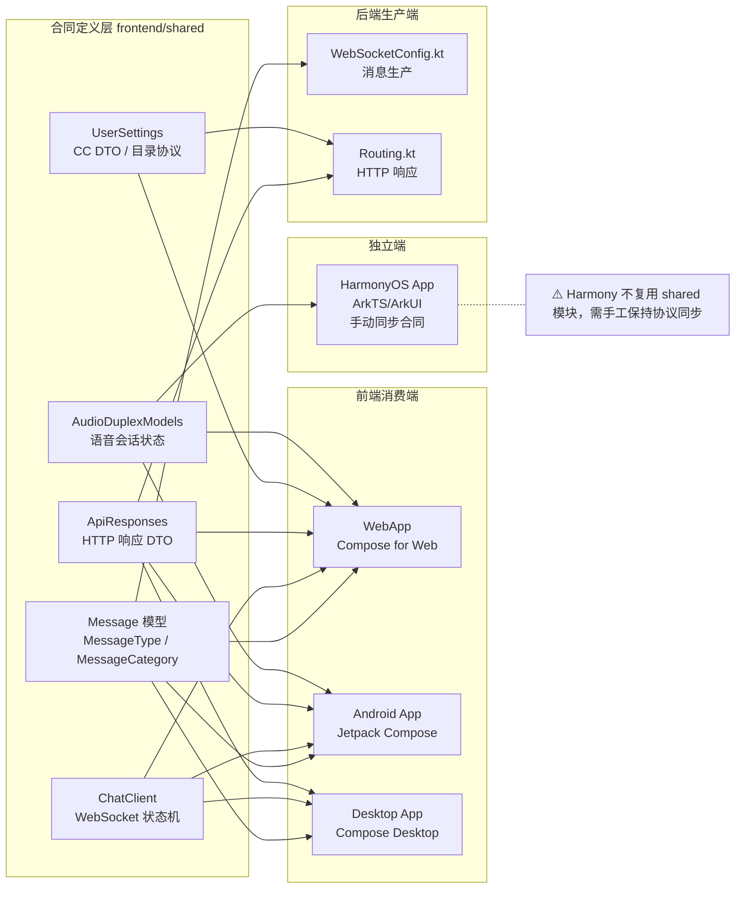
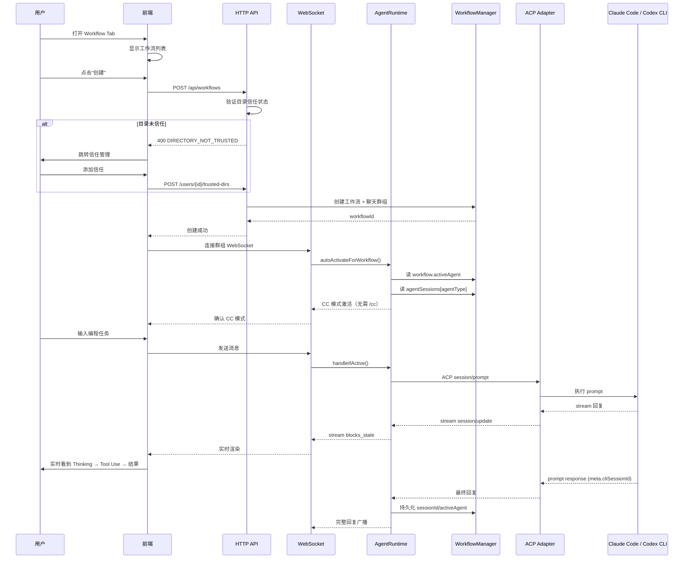
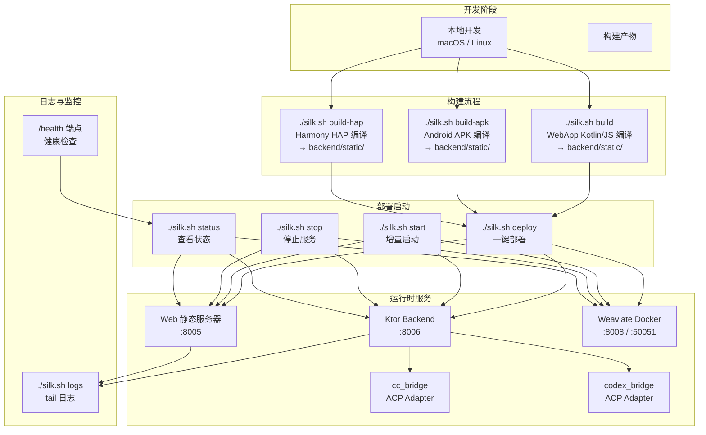
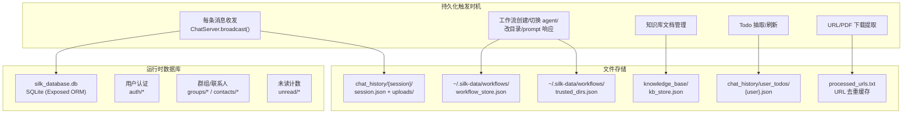
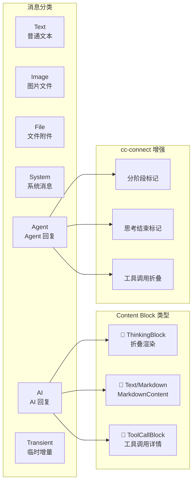

# Silk 业务运营流程图

> 自动生成，反映当前架构与业务逻辑。

---

## 1. 系统架构总览

---

## 2. 聊天消息处理管道（核心业务流）

---

## 3. 前端 Tab 导航与用户操作流程

---

## 4. 多端消息合同与跨端流转

---

## 5. Workflow + Agent 完整执行流

---

## 6. 部署与运维流程

---

## 7. 数据持久化全景

---

## 8. 消息类型与内容块渲染

---

## 图例说明

| 颜色 | 含义 |
|------|------|
| 🟦 蓝色框 | 前端用户界面 |
| 🟩 绿色框 | 后端服务/组件 |
| 🟧 橙色框 | 外部 Agent/Adapter 进程 |
| 🟪 紫色框 | 数据存储层 |
| ⬜ 灰色框 | 外部 API/服务 |
| ➡️ 实线箭头 | 主要数据流 |
| - - ➡️ 虚线箭头 | 次要/备选数据流 |
