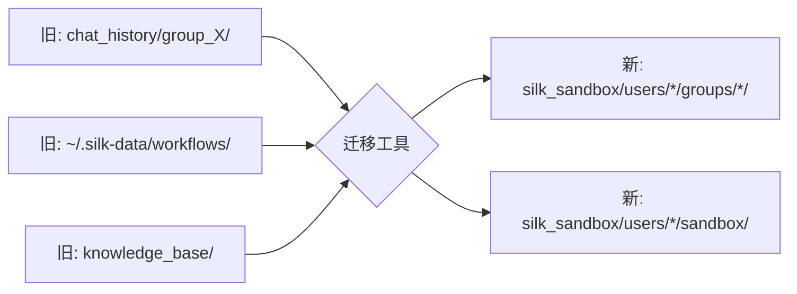

# Sandbox 隔离架构设计方案

> 创建日期：2026-05-27
> 状态：规划中

## 1. 问题定义

### 1.1 当前现状

Silk 当前的数据存储是**扁平命名空间**：

| 存储类型 | 当前路径 | 隔离性 |
|---------|---------|-------|
| SQLite 用户/群组/成员 | `./silk_database.db` | ❌ 所有用户同库 |
| 聊天历史 | `chat_history/group_<groupId>/` | ❌ 群组间无文件隔离 |
| 上传文件 | `chat_history/group_<groupId>/uploads/` | ❌ 群组间共享目录 |
| 用户 Todo | `chat_history/user_todos/<user>.json` | 弱隔离（依赖路径拼写） |
| Workflow | `~/.silk-data/workflows/workflow_store.json` | ❌ 全局单文件 |
| KB | `knowledge_base/kb_store.json` | ❌ 全局单文件 |

所有群的聊天历史都在同一个根下，任意模块若路径拼写错误可能越权访问。

### 1.2 目标隔离模型

```
silk_sandbox/
└── users/
    └── <userId>/
        ├── sandbox/                    ← 用户个人空间（私聊、个人数据）
        │   ├── private_chat/
        │   ├── user_settings.json
        │   └── user_todos.json
        ├── groups/
        │   ├── <groupIdA>/            ← 群 A 的子沙箱
        │   │   ├── session.json       ← 群消息历史副本
        │   │   ├── chat_history.json  ← 消息条目
        │   │   └── uploads/
        │   └── <groupIdB>/            ← 群 B 的子沙箱
        │       ├── session.json
        │       ├── chat_history.json
        │       └── uploads/
        └── .sandbox_manifest.json     ← 元数据索引（可选）
```

**隔离约束**：
- `users/A/sandbox/` ⊥ `users/B/sandbox/`（不同用户的沙箱隔离）
- `users/A/groups/X/` ⊥ `users/A/sandbox/`（子沙箱不能访问父沙箱）
- `users/A/groups/X/` ⊥ `users/A/groups/Y/`（不同子沙箱隔离）
- `users/A/groups/X/` ⊥ `users/B/groups/X/`（不同用户的同群子沙箱隔离）

### 1.3 消息投递语义

> 一条群消息 → 写入 **N 份副本**（N = 群成员数）

当 User A 在 Group X 发送消息：
1. 后端接收消息
2. 查询 Group X 当前成员列表 [A, B, C]
3. 将消息写入：
   - `users/A/groups/X/chat_history.json`（写自己）
   - `users/B/groups/X/chat_history.json`（写 B 的子沙箱）
   - `users/C/groups/X/chat_history.json`（写 C 的子沙箱）
4. 广播通知各在线成员的客户端

## 2. 架构变更

### 2.1 新增核心模块

#### 2.1.1 `backend/sandbox/SandboxManager.kt` — 沙箱管理器

```kotlin
// 核心职责：
// 1. 解析当前请求上下文的 userId/groupId
// 2. 将路径请求映射到对应沙箱路径
// 3. 执行路径合法性校验（防止路径穿越）
// 4. 提供"安全读/写"门面

class SandboxManager(private val baseDir: String = "silk_sandbox") {
    
    /** 获取用户沙箱路径（个人空间） */
    fun userSandboxPath(userId: String): Path
    
    /** 获取群子沙箱路径（用户维度） */
    fun groupSubSandboxPath(userId: String, groupId: String): Path
    
    /** 安全写入：将 content 写入目标用户的子沙箱 */
    fun writeToUserGroupSandbox(
        targetUserId: String, 
        groupId: String, 
        relativePath: String, 
        content: ByteArray
    )
    
    /** 批量写入：将消息写入所有群成员的子沙箱 */
    fun fanOutWrite(
        groupId: String, 
        memberUserIds: List<String>,
        relativePath: String,
        contentSupplier: (userId: String) -> ByteArray
    )
    
    /** 安全读取：验证请求者有权读取该路径 */
    fun safeRead(
        requestUserId: String,
        targetUserId: String,
        groupId: String?,
        relativePath: String
    ): ByteArray?
    
    /** 路径安全校验：禁止 ../ 等穿越 */
    fun validatePath(parts: List<String>)
}
```

#### 2.1.2 `backend/sandbox/SandboxAccessFilter.kt` — 请求级访问过滤

```kotlin
// HTTP 拦截器，为每个请求注入 sandbox context
// 从 JWT/请求参数中提取当前 userId
// 校验路径是否符合用户权限
```

#### 2.1.3 `backend/sandbox/SandboxInitializer.kt` — 沙箱初始化

```kotlin
// 用户注册时自动创建
// 群组加入时自动初始化子沙箱
// 群组退出时标记/清理
```

### 2.2 穿透修改的已有模块

| 模块 | 改动 |
|------|------|
| `ChatHistoryManager.kt` | 从写 `chat_history/group_<id>/` 改为通过 `SandboxManager.fanOutWrite()` 写所有成员的子沙箱 |
| `historyManager.getSessionDir()` | 废弃，替换为 `SandboxManager.groupSubSandboxPath()` |
| `Routing.kt` / 文件路由 | 文件上传/下载增加沙箱上下文参数 |
| `routes/FileRoutes.kt` | 上传文件改为写入各成员子沙箱 `uploads/` |
| `UserTodoStore.kt` | 路径改为 `users/<userId>/sandbox/user_todos.json` |
| `WorkflowManager.kt` | 用户级 workflow 数据移入 `users/<userId>/sandbox/workflows/` |
| `KnowledgeBaseManager.kt` | 用户级 KB 数据移入 `users/<userId>/sandbox/kb/` |
| `WebSocketConfig.kt` | ChatServer 构造函数接收 userId + groupId |
| AI `searchContext()` | grep 路径局限在用户当前群组子沙箱 |

### 2.3 SQLite 层面

**方案比较**：

| 方案 | 优点 | 缺点 |
|------|------|------|
| **A: 单库 + sandbox_id 列** | 改动最小，现有查询只需追加 `WHERE sandbox_id = ?` | 隔离不彻底，需代码层面保证过滤 |
| **B: 每用户独立 SQLite** | 强隔离，一个用户数据泄露不影响他人 | 连接管理复杂，跨用户统计困难 |
| **C: 混合：公共表 + 用户表** | 公共表（用户、群组元数据）单库，消息/数据按用户分库 | 两套连接管理 |

**推荐方案 A（渐进式）**，后期可按需升级到 C：

在核心表中增加 `sandbox_id` 列，作为所有查询的隐含过滤条件。后端在请求级注入当前 sandbox context，所有 repository 方法自动追加 sandbox 过滤，无需每处手动写。

但在文件层面使用方案 B 的隔离（即每用户文件目录），形成**"SQLite 软隔离 + 文件系统硬隔离"**双层策略。

## 3. 实施计划

### Phase 1：基础设施（2-3 天）

```
Step 1.1: 创建 SandboxManager 核心类
  - 沙箱目录结构常量
  - 路径安全校验（path traversal prevention）
  - 文件读写门面方法
  - 单元测试：SandboxManagerTest

Step 1.2: 创建 SandboxInitializer
  - 用户注册 hook → createUserSandbox(userId)
  - 加入群组 hook → initializeGroupSubSandbox(userId, groupId)
  - 退出群组 hook → deactivateGroupSubSandbox(userId, groupId)
  - 删除用户 hook → archiveUserSandbox(userId)

Step 1.3: 配置化
  - silk.sandbox.baseDir 系统属性（默认 silk_sandbox/）
  - 向后兼容标记：silk.sandbox.legacyMode=true（回退旧路径）
  - 迁移工具：migrateLegacyToSandbox()
```

### Phase 2：SQLite 沙箱感知（1-2 天）

```
Step 2.1: 表结构增加 sandbox_id
  - messages 表（若迁移到 SQLite）加 sandbox_id
  - user_todos 表加 sandbox_id
  - 现有索引调整

Step 2.2: Repository 层沙箱过滤
  - 为 UserRepository / GroupRepository 注入 SandboxContext
  - 自动 WHERE sandbox_id = ?
  - 跨沙箱操作（如群主删群）需要 elevation

Step 2.3: SandboxContext 注入机制
  - 从 JWT token 解析 userId
  - 从请求参数/路径解析 groupId
  - 构建 SandboxContext(userId, groupId, sandboxType)
  - Ktor 插件：SandboxContextPlugin
```

### Phase 3：消息流沙箱化（3-4 天）

```
Step 3.1: ChatHistoryManager 重构
  - 废 getSessionDir() / getSessionFile() / getHistoryFile()
  - 新方法接受 SandboxContext
  - 写路径：users/<userId>/groups/<groupId>/session.json

Step 3.2: 消息投递 fan-out
  - ChatServer.broadcast() 调用 SandboxManager.fanOutWrite()
  - 群消息写入所有在线成员的子沙箱
  - 异步写入离线成员（不阻塞广播）

Step 3.3: 历史回放
  - 用户请求历史时，只读自己的子沙箱
  - getChatHistory(userId, groupId) → SandboxManager.safeRead()

Step 3.4: 文件上传沙箱化
  - routes/FileRoutes.kt 上传路径改为 <sandbox>/groups/<groupId>/uploads/
  - 下载时校验请求者 userId 与文件所属子沙箱匹配
  - URL processed_urls.txt 移入子沙箱
```

### Phase 4：已有数据域迁移（2-3 天）

```
Step 4.1: User Todo
  - UserTodoStore 路径改为 sandbox/sandbox/user_todos.json
  - Todo 写入仅影响当前用户沙箱
  - Todo 提取服务 scope 限定在用户可见的群组子沙箱

Step 4.2: Workflow
  - ~/.silk-data/workflows/workflow_store.json → users/<userId>/sandbox/workflows/
  - 迁移工具复制旧数据
  - 信任目录配置同样 per-user

Step 4.3: Knowledge Base
  - knowledge_base/kb_store.json → users/<userId>/sandbox/kb/
  - 用户级知识库隔离

Step 4.4: 私聊
  - 私聊视为特殊"群"：双方各有一个子沙箱
  - 路径：users/<userId>/groups/private_<contactId>/
  - 双方各自存自己的聊天副本
```

### Phase 5：安全审计与验证（1-2 天）

```
Step 5.1: 路径穿越测试
  - 模拟请求包含 ../ 等路径
  - SandboxManager.validatePath 拒绝

Step 5.2: 跨用户越权测试
  - User A 尝试读 User B 的沙箱文件
  - SandboxManager.safeRead 拒绝

Step 5.3: 子沙箱隔离测试
  - User A 尝试从 groups/X 读 sandbox/ 的文件
  - ChatServer 跨群读历史
  - 文件下载越权

Step 5.4: 迁移工具测试
  - 从旧 chat_history 格式到新沙箱格式
  - 数据完整性校验
  - 回滚路径

Step 5.5: 性能基准
  - fan-out 写入延迟（N=10, 50, 100 成员）
  - 文件上传吞吐量
  - SQLite 查询延迟
```

## 4. 文件清单

### 新增文件

| 文件 | 内容 |
|------|------|
| `backend/src/main/kotlin/com/silk/backend/sandbox/SandboxManager.kt` | 核心沙箱管理器 |
| `backend/src/main/kotlin/com/silk/backend/sandbox/SandboxContext.kt` | 沙箱上下文 Data Class |
| `backend/src/main/kotlin/com/silk/backend/sandbox/SandboxInitializer.kt` | 注册/加入/退出钩子 |
| `backend/src/main/kotlin/com/silk/backend/sandbox/SandboxAccessFilter.kt` | Ktor 请求拦截器 |
| `backend/src/main/kotlin/com/silk/backend/sandbox/SandboxMigrationTool.kt` | 旧→新格式迁移工具 |
| `backend/src/test/kotlin/com/silk/backend/sandbox/SandboxManagerTest.kt` | 沙箱管理器单元测试 |
| `backend/src/test/kotlin/com/silk/backend/sandbox/SandboxIsolationTest.kt` | 隔离性集成测试 |

### 需修改的文件

| 文件 | 改动要点 |
|------|---------|
| `ChatHistoryManager.kt` | 路径构建改用 SandboxManager；消息写入改为 fan-out |
| `WebSocketConfig.kt` | ChatServer 注入 SandboxManager 引用 |
| `Routing.kt` | 安装 SandboxContextPlugin；文件路由加沙箱上下文 |
| `routes/FileRoutes.kt` | 上传/下载路径沙箱化 |
| `database/Models.kt` | 需要时加 sandboxId 字段 |
| `database/GroupRepository.kt` | 群成员变更时通知 SandboxInitializer |
| `todos/UserTodoStore.kt` | 路径改为沙箱路径 |
| `workflow/WorkflowManager.kt` | 存储路径改为用户沙箱 |
| `kb/KnowledgeBaseManager.kt` | 存储路径改为用户沙箱 |
| `ai/DirectModelAgent.kt` | searchContext 路径局限 |

## 5. 关键设计决策

### 5.1 为什么选择写放大（fan-out）而不是读时过滤？

| 维度 | 写放大（本方案） | 读时过滤 |
|------|----------------|---------|
| 隔离强度 | ✅ 物理隔离，无法越权 | ❌ 依赖 SQL WHERE 保证 |
| 删除用户 | ✅ 直接删目录即可 | ❌ 需扫描所有群清理 |
| 一致性 | ❌ 写操作多 N 倍 | ✅ 一个文件 |
| 磁盘占用 | ❌ N 倍（但消息文本很小） | ✅ 一份 |
| 实现复杂度 | 中等 | 更低 |

**判定**：对于即时通讯，每条消息几 KB 文本，N 倍副本的磁盘成本可接受。物理隔离带来的安全增益远大于存储成本。

### 5.2 为什么文件系统 + SQLite 双层隔离？

- **文件系统层**：物理路径限制，即使代码 bug 也不会读到其他用户文件
- **SQLite 层**：元数据查询友好，便于用户管理、群组管理
- 文件系统是**最后防线**，SQLite 是**高效索引**

### 5.3 现有数据迁移策略



迁移工具以只读方式扫描旧路径，为每个用户构建新沙箱，然后切换配置。旧路径保留一段时间作为回退。

### 5.4 运行时流程（发送消息）

```
用户 A 在群 X 发送消息
  │
  ├─ WebSocketConfig.ChatServer.broadcast()
  │    │
  │    ├─ 1. 去重
  │    ├─ 2. 写入内存历史
  │    ├─ 3. SandboxManager.fanOutWrite()  ← 新增
  │    │    ├─ 查 Group X 成员 [A, B, C]
  │    │    ├─ 写 users/A/groups/X/chat_history.json
  │    │    ├─ 写 users/B/groups/X/chat_history.json
  │    │    └─ 写 users/C/groups/X/chat_history.json
  │    ├─ 4. 未读计数
  │    └─ 5. 广播到所有在线 session
  │
  └─ URL/PDF 处理（异步）
       └─ 文件下载到各成员子沙箱 uploads/
```

## 6. 验证策略

| 阶段 | 验证命令 | 覆盖 |
|------|---------|------|
| 单元测试 | `./gradlew :backend:test --tests "*SandboxManager*"` | 路径安全、读写门面 |
| 集成测试 | `./gradlew :backend:test --tests "*SandboxIsolation*"` | 跨用户/跨群越权 |
| 旧合同回归 | `./gradlew :backend:test --tests "*BackendFileContract*"` | 文件路由不改坏 |
| 旧合同回归 | `./gradlew :backend:test --tests "*BackendWebSocketContract*"` | WebSocket 协议不改坏 |
| 全量后端 | `./gradlew :backend:test` | 全部回归 |
| 迁移验证 | 手动运行迁移工具 + diff | 前后数据一致 |

## 7. 风险与缓解

| 风险 | 可能性 | 影响 | 缓解措施 |
|------|--------|------|---------|
| fan-out 写性能瓶颈 | 中 | 高 | 异步写入离线成员；批处理合并 |
| 迁移数据不一致 | 低 | 高 | 迁移后 diff 校验；保留旧路径只读 |
| 旧代码路径未覆盖 | 中 | 中 | 按模块清单逐一审查；全量测试回归 |
| SQLite sandbox_id 漏加 | 中 | 高 | SandboxContextPlugin 强制注入；编译期 lint |
| 磁盘暴增 | 低 | 中 | 写放大系数 = 群成员数；10 人群 × 10 条/天 × 1KB ≈ 100KB/天 |
