# Silk 系统流程与业务架构图

本文档使用 Mermaid 语法绘制 Silk 多端聊天系统的核心流程与业务架构图。

---

## 1. 系统业务架构总览

```mermaid
graph TB
    subgraph Frontend["前端层"]
        Web["🌐 WebApp<br/>Compose for Web"]
        Android["📱 AndroidApp<br/>Jetpack Compose"]
        Desktop["🖥️ DesktopApp<br/>Compose Desktop"]
        Harmony["📟 HarmonyApp<br/>ArkTS/ArkUI"]
        Shared["📦 frontend/shared<br/>消息模型/Ws客户端"]
    end

    subgraph Backend["后端层 - Ktor JVM"]
        App["Application.kt<br/>启动入口"]
        Routing["Routing.kt<br/>HTTP路由总入口"]
        WS["WebSocketConfig.kt<br/>ChatServer 消息主链"]
        AI["ai/DirectModelAgent.kt<br/>AI引擎 + Tool Calling"]
        Agent["agents/core/AgentRuntime.kt<br/>Agent框架 (ACP)"]
        DB["database/<br/>SQLite + Exposed"]
        
        subgraph Domain["业务领域模块"]
            Todo["todos/UserTodoStore.kt<br/>待办事项"]
            Workflow["workflow/WorkflowManager.kt<br/>工作流"]
            KB["kb/KnowledgeBaseManager.kt<br/>知识库"]
            Trust["trust/TrustedDirManager.kt<br/>目录信任"]
            Export["export/<br/>导出 (Obsidian/PDF)"]
            File["routes/FileRoutes.kt<br/>文件服务"]
            ASR["routes/AsrRoutes.kt<br/>语音识别"]
        end
        
        subgraph Storage["持久化存储"]
            SQLite["silk_database.db<br/>用户/群组/联系人/未读"]
            ChatHistory["chat_history/<br/>消息历史/上传文件"]
            WfStore["~/.silk-data/workflows/<br/>工作流存储"]
            KBStore["knowledge_base/<br/>知识库存储"]
        end
    end

    subgraph External["外部系统"]
        ClaudeCLI["Claude CLI"]
        CodexCLI["Codex CLI"]
        Cursor["Cursor IDE"]
        GeminiCLI["Gemini CLI"]
        
        subgraph Bridges["桥接适配器"]
            CCBridge["cc_bridge/acp_adapter.py<br/>ACP → Claude CLI"]
            CodexBridge["codex_bridge/codex_adapter.py<br/>ACP → Codex CLI"]
            FeishuBot["feishu_bot/main.py<br/>飞书网关"]
        end
        
        AudioWorker["Audio Duplex Worker<br/>(上游语音AI)"]
        AnthropicAPI["Anthropic Messages API"]
        ASRService["ASR 语音识别服务"]
    end

    Frontend -->|HTTP + WebSocket| Backend
    Shared --> Web
    Shared --> Android
    Shared --> Desktop
    Harmony -.->|独立实现| Backend
    
    Routing --> WS
    Routing --> File
    Routing --> ASR
    WS --> AI
    WS --> Agent
    Agent --> CCBridge
    Agent --> CodexBridge
    CCBridge --> ClaudeCLI
    CodexBridge --> CodexCLI
    
    Agent -.-> Cursor
    Agent -.-> GeminiCLI
    
    AI --> AnthropicAPI
    ASR --> ASRService
    
    FeishuBot -->|HTTP| Backend
    
    WS --> DB
    WS --> ChatHistory
    WS --> Domain
    
    Domain --> Storage
```

---

## 2. 运行时主消息流程

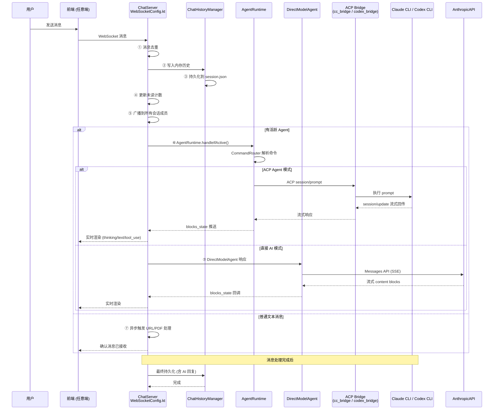

---

## 3. 聊天/WebSocket 消息处理详细流程

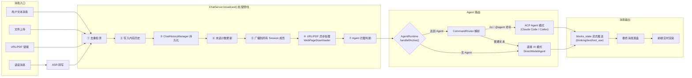

---

## 4. Agent 框架与 ACP 协议流程

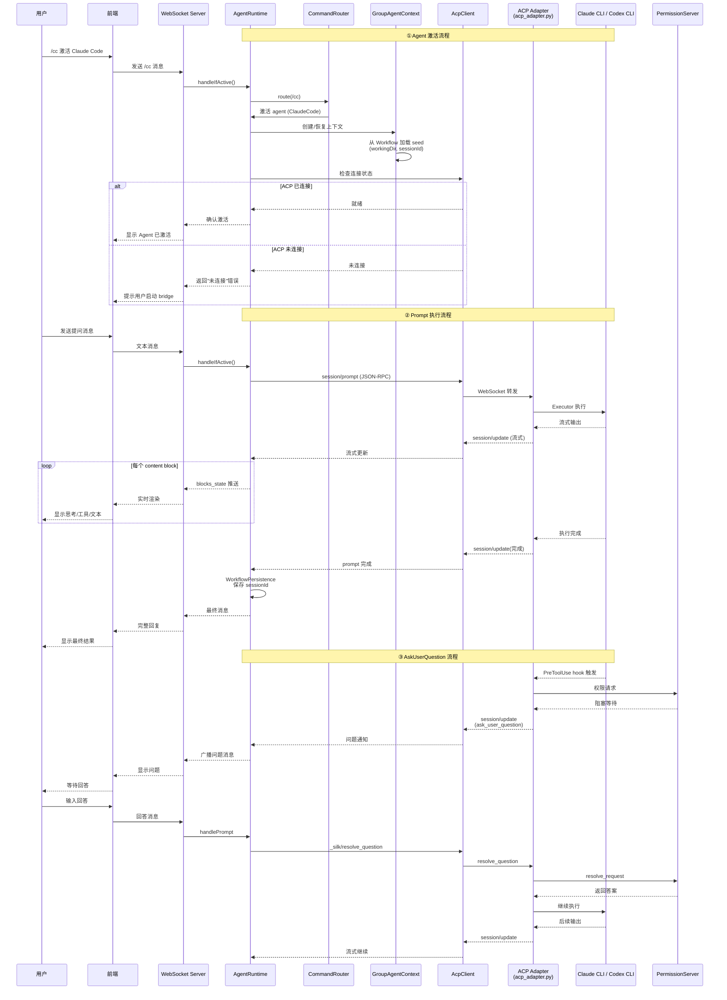

---

## 5. cc-connect 集成流程

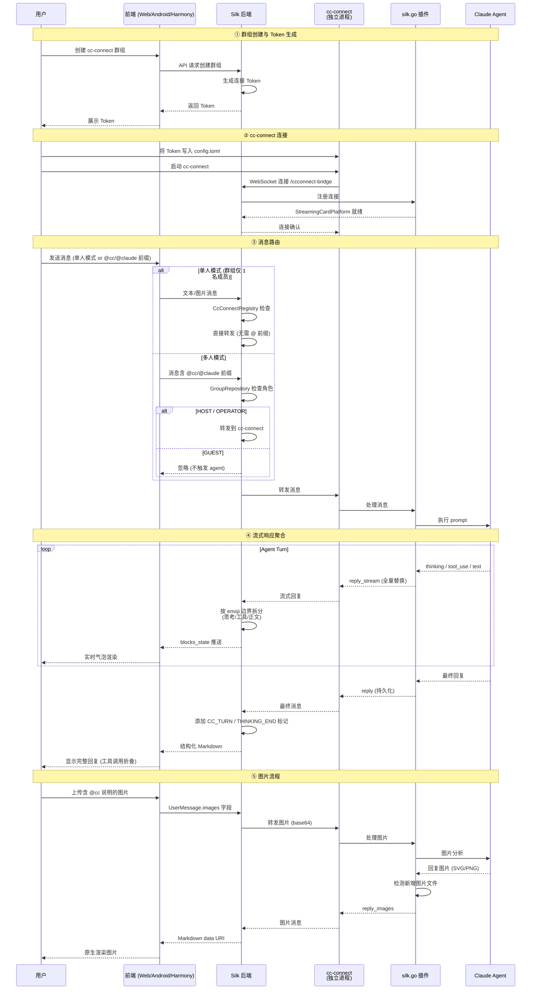

---

## 6. cc-connect 消息聚合与渲染细节

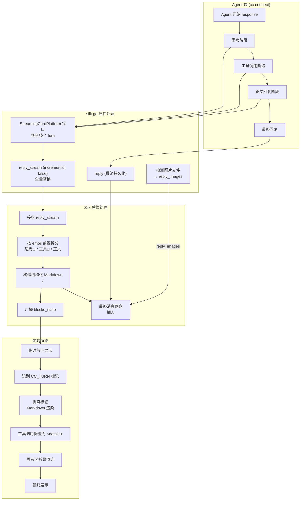

---

## 7. 业务领域模块关系图

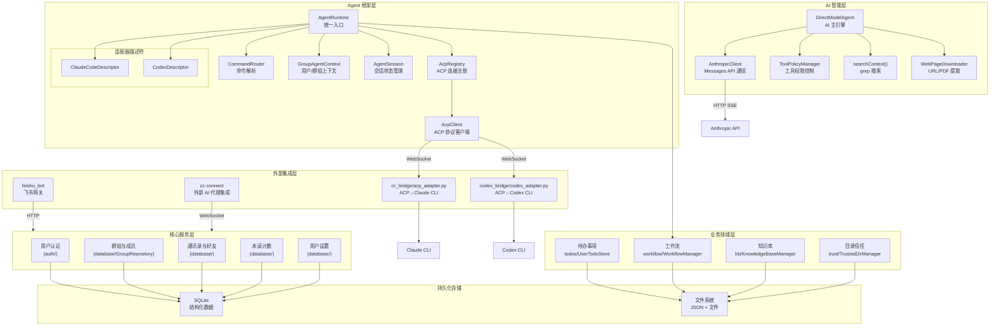

---

## 8. Audio Duplex 音频双工流程

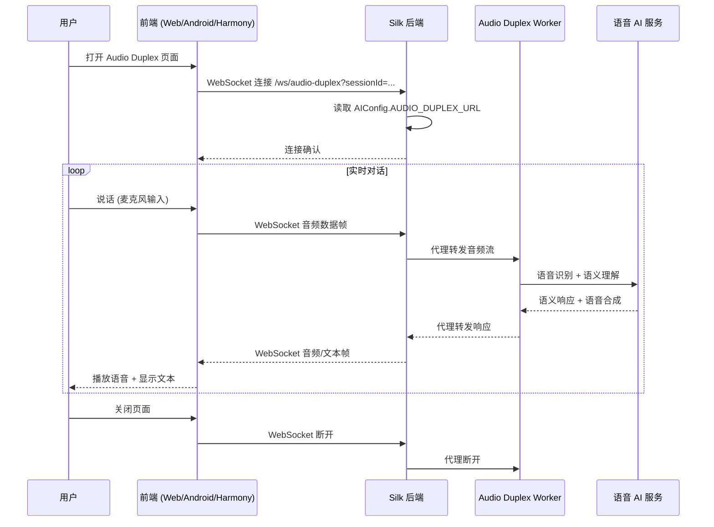

---

## 9. 文件上传/下载与 URL 摄入流程

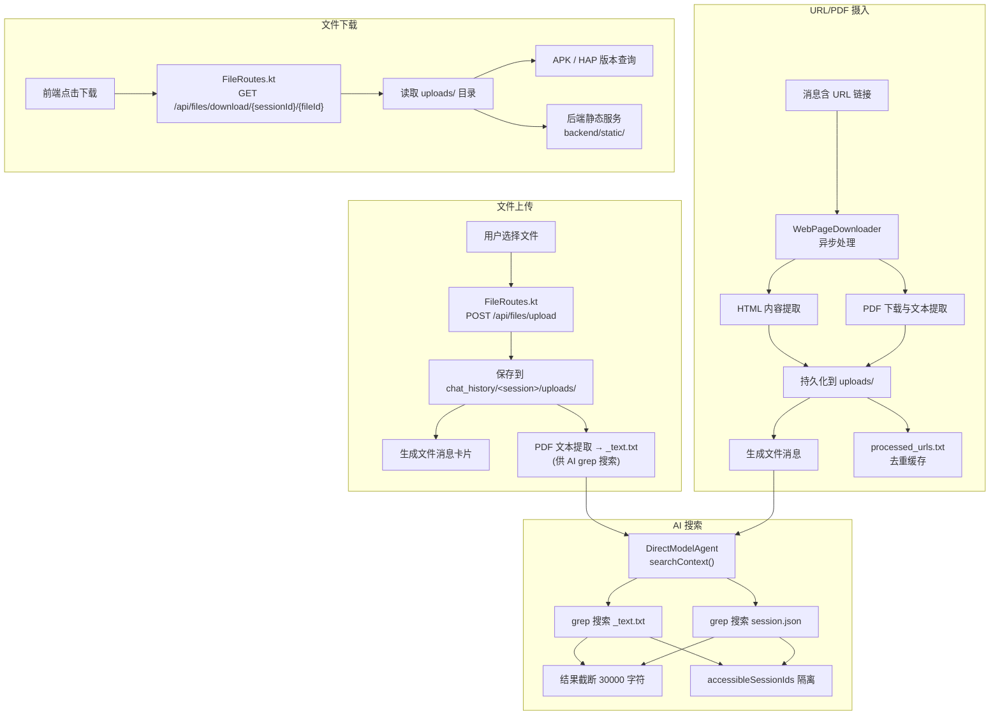

---

## 10. 多端前端架构图

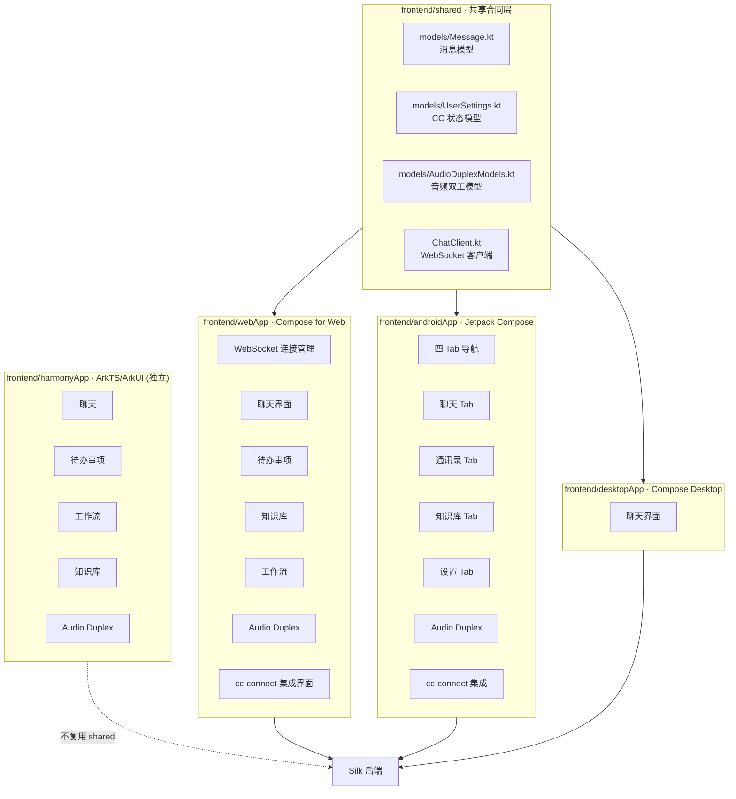

---

## 11. 持久化存储与数据流

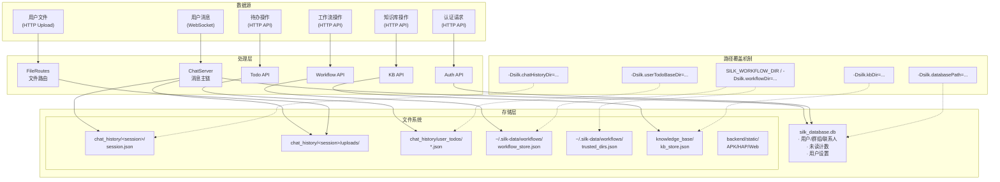

---

## 12. 飞书网关集成流程

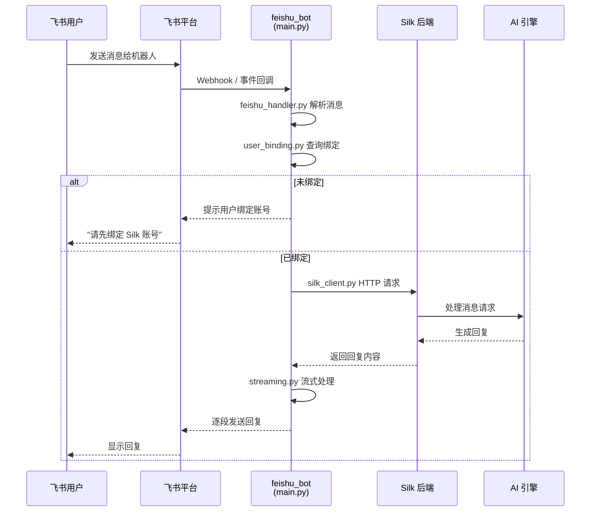

---

## 索引

| 图号 | 名称 | 说明 |
|------|------|------|
| 1 | 系统业务架构总览 | 全栈组件关系图，涵盖前端、后端、外部系统 |
| 2 | 运行时主消息流程 | 用户消息从发送到回复的完整时序 |
| 3 | 聊天/WebSocket 消息处理详细流程 | ChatServer.broadcast() 处理管线 |
| 4 | Agent 框架与 ACP 协议流程 | Agent 激活、Prompt 执行、AskUserQuestion 完整流程 |
| 5 | cc-connect 集成流程 | 外部 AI 代理的群组集成全链路 |
| 6 | cc-connect 消息聚合与渲染细节 | 流式消息聚合、拆分、前端渲染 |
| 7 | 业务领域模块关系图 | 核心服务、业务领域、AI、Agent、外部集成依赖 |
| 8 | Audio Duplex 音频双工流程 | 实时语音对话代理 |
| 9 | 文件上传/下载与 URL 摄入流程 | 文件、链接处理与 AI 搜索 |
| 10 | 多端前端架构图 | 四端前端代码组织与共享合同 |
| 11 | 持久化存储与数据流 | 数据源、处理层、存储与覆盖机制 |
| 12 | 飞书网关集成流程 | 飞书到 Silk 的网关消息流 |
